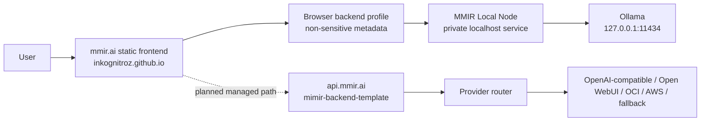
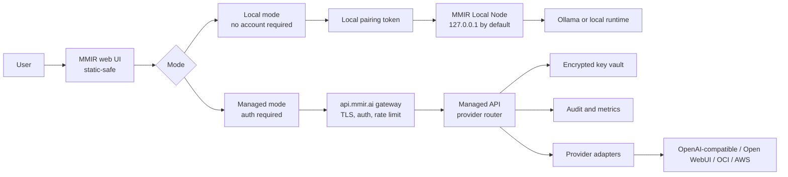
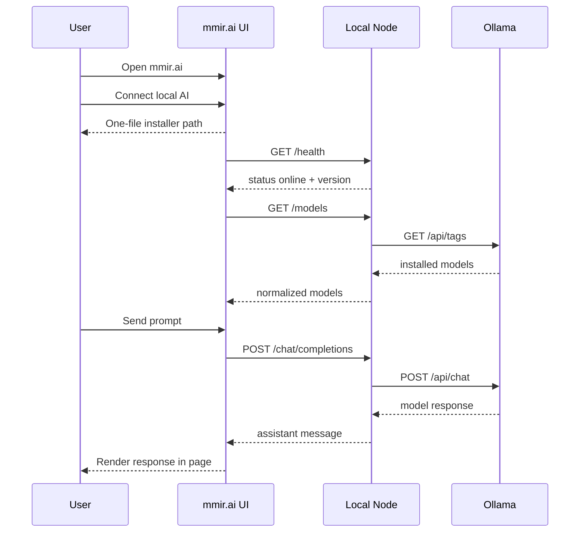

# MMIR Architecture Baseline

This document defines the current and target architecture boundaries for the MMIR launch path.

## Architecture Intent

MMIR is the orchestration layer for trusted AI: an AI control plane for connecting models, roles, workflows, memory, knowledge, routing and policy across local, edge, self-hosted and managed AI systems.

MMIR is not a chatbot, an Ollama wrapper, a local frontend or an OpenAI clone. The architecture must keep the product above the models while making the first local AI loop feel simple.

MMIR should feel like one calm AI workspace while internally separating:

- public UI
- local private runtime
- managed API and routing
- provider adapters
- infrastructure provisioning
- future workflow, marketplace and enterprise layers

## Current Architecture

Current state:

- `inkognitroz.github.io` is the public static UI.
- `mmir-local-node` exists and can proxy local Ollama, but needs hardening.
- `mimir-backend-template` exists and is the first managed API candidate.
- The frontend has an in-page chat runtime and beta orchestration surfaces.
- The ground-zero product loop remains the highest-risk activation path: open mmir.ai, connect local AI, install one file, see local models and chat instantly.

## Target MVP Architecture

## Trust Boundaries

| Boundary | What crosses | Controls |
|---|---|---|
| Browser to static assets | HTML/CSS/JS/config | No secrets in assets, CSP later, Subresource Integrity where useful |
| Browser to local node | Health, model list, chat requests | Localhost default, explicit allowed origins, pairing token, size limits |
| Browser to managed API | Authenticated API requests | TLS, auth, rate limit, audit, CORS allowlist |
| Managed API to providers | Provider requests and responses | Server-side secrets, adapter validation, timeout, retry policy |
| Infrastructure pipeline to cloud | Terraform plans/applies | Protected workflow, manual approval for production, no plain secrets |

## Component Responsibilities

### Public Frontend

Owns:

- first screen and product promise
- orchestration UI and configuration controls
- chat transcript and controls
- backend profile metadata
- live/beta/planned/premium labels
- local onboarding flow

Must not own:

- model runtime execution
- model inventory truth beyond connected backend reports
- provider API keys
- billing decisions
- organization permissions
- managed routing policy
- permanent team memory

### Local Node

Owns:

- local model discovery
- Ollama/local runtime adapter
- local chat execution
- hardware hints
- local pairing and access control

Must not own:

- public inbound routing by default
- shared marketplace state
- paid provider credentials
- organization policy authority

### Managed API

Owns:

- canonical API contract
- provider router
- OpenAI-compatible adapter layer
- auth and authorization
- encrypted secret references
- audit and metrics

Must not own:

- static web rendering
- cloud provisioning implementation details
- raw local node control without pairing/trust

### Infrastructure

Owns:

- DNS/gateway/TLS/routing
- runtime templates
- network policy
- deployment validation
- rollback and recovery runbooks

Must not own:

- product feature state
- prompts or agent behavior
- provider keys outside secret stores

## Data Classification

| Data | Classification | Storage rule |
|---|---|---|
| UI copy and docs | Public | May live in public repo |
| Backend URL label | User local metadata | Browser storage is acceptable |
| Provider API key | Secret | Server-side encrypted vault only |
| Local pairing token | Sensitive local secret | Local node and browser only, never committed |
| Chat prompt local mode | Private user data | Stays local unless user selects managed route |
| Chat prompt managed mode | Sensitive app data | Transit only by default, no prompt logs unless explicit opt-in |
| Audit events | Restricted operational data | No raw prompt content by default |

## Ground-Zero Local AI Sequence

## API Repo Decision

For the MVP, use `mimir-backend-template` as the first `api.mmir.ai` codebase.

Reason:

- It already has the right role and private visibility.
- It avoids delaying the product loop on repo administration.
- It can later be renamed or replaced once the API surface is real.

No new repo should be created until one of these is true:

- the managed API needs a separate production lifecycle from the template repo
- the API gains enough users that rename/history clarity matters
- infrastructure automation needs a separate deployment repo for compliance

## Architectural Invariants

- A static page can be public; secrets cannot.
- MMIR is the control plane above models, not a wrapper around one model.
- Local AI must be useful without cloud dependency.
- Managed AI must be protected through one ingress.
- Provider-specific code belongs behind adapters.
- Workflows, memory and routing are more strategic than chat alone.
- Every advanced platform concept must map back to the first local AI activation loop or stay planned.
