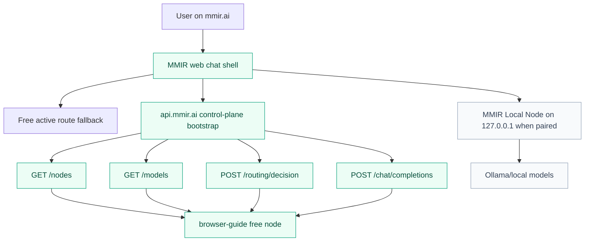
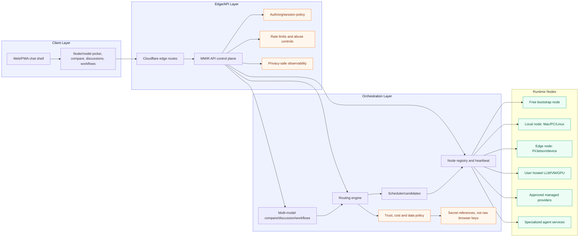
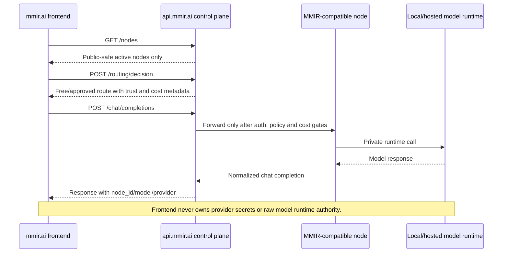
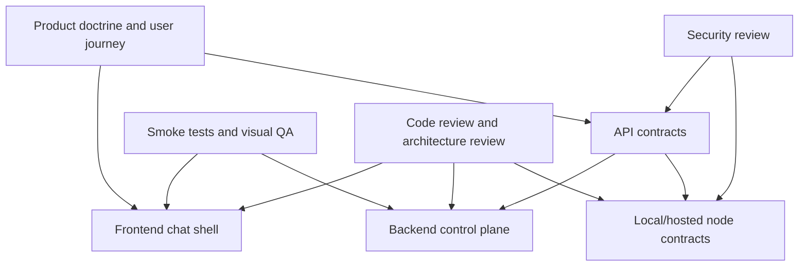

# MMIR Architecture: Today And Target

MMIR is the orchestration layer for trusted AI. The architecture must keep user experience simple while preserving clear boundaries between frontend, control plane, local nodes, hosted nodes, policy, secrets and observability.

## Current P0 Architecture

Current rule: the public product must never dead-end. If no paired local/hosted node is available, MMIR still exposes the free `browser-guide` route with `no_paid_routes_started: true`.

## Target Scalable Architecture

## Zero-Trust Boundary

## Agent Work Lanes

Agent rules:

- Keep P0 changes small and tied to a GitHub issue.
- Do not remove existing functionality unless there is a tracked security/stability reason.
- Start with contracts and tests before broad UI expansion.
- Backend owns auth, policy, routing, rate limits, cost gates and secret references.
- Frontend owns interaction quality, visibility and user journey, not runtime authority.

## Near-Term P0 Sequence

1. Keep first-click chat live through `browser-guide`.
2. Show active nodes and attachable models in the chat shell.
3. Complete local-node active heartbeat/model inventory shape.
4. Implement zero-trust node registration storage.
5. Add hosted LLM setup plan with server-side secret references.
6. Add compare/best-answer/discussion orchestration after the single-route journey is stable.
