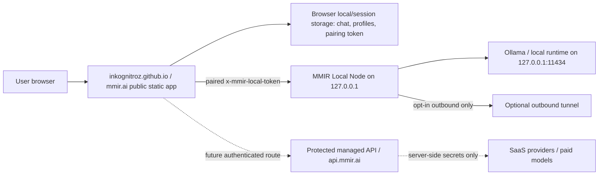
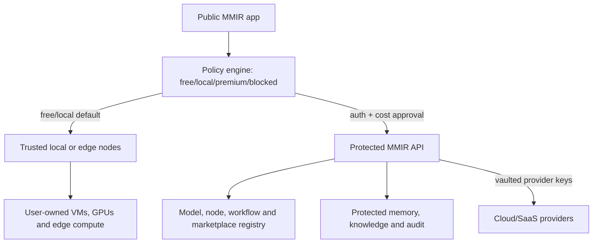

# MMIR Control-Plane Boundary

Updated: 2026-05-22

MMIR is the orchestration layer for trusted AI. The public website can explain, configure and initiate trusted routes, but it must not own secrets, paid authority, raw runtime exposure or private organization data.

## Current Architecture

## Target Architecture

## Boundary Rules

| Zone | Owns | Must not own |
|---|---|---|
| Public frontend | UI, public-safe catalogs, local profile labels, local/session preferences | provider keys, billing authority, shared secrets, private org data |
| Browser session | local pairing token, transient pairing code, local chat if user keeps it | provider API keys, managed refresh tokens, paid compute authority |
| MMIR Local Node | pairing, local model discovery, local chat contract, model pull/delete, hardware hints | public raw Ollama exposure, SaaS provider secrets |
| Managed API | auth, rate limits, audit, policy, server-side secret references, memory/knowledge | static UI concerns, direct unauthenticated paid execution |
| Provider/runtime adapters | bounded provider calls, model metadata, timeouts | leaking provider keys or raw prompts into public logs |
| Infrastructure repos | plan/apply templates and environment setup | unreviewed production applies or public credentials |

## Route Ownership

| Route | Current owner | Trust requirement | Public status |
|---|---|---|---|
| `/health`, `/status`, `/node/identity` | `mmir-local-node` | public-safe discovery | live/beta |
| `/pair`, `/pairing/sessions` | `mmir-local-node` | local request or short-lived local code | beta |
| `/hardware`, `/models` | `mmir-local-node` | paired local token | live/beta |
| `/models/pull`, `/models/delete` | `mmir-local-node` | paired local token and valid model name | beta |
| `/chat/completions` | `mmir-local-node` and managed API later | paired/authenticated route | beta |
| `/memory/*`, `/knowledge/*`, `/workflows/*`, `/training/*` | managed API template | protected backend contract | beta/planned |
| provider routes | managed API only | auth, policy, rate limit, cost gate, secret vault | blocked until safe |

## Cost And Security Defaults

- Free/local is the default path.
- Paid/provider/cloud routes stay blocked until identity, rate limits, audit and cost policy exist.
- Public copy may describe premium futures, but cannot make them look live.
- `inkognitroz.github.io` may stay public because it must remain harmless by construction.
- Secrets belong in private/protected repos, local secure storage or managed secret stores.

## D117 Public Safety Audit Gate

`scripts/public-safety-audit.js` is the public repo gate for accidental secret and paid-route exposure. It scans public/docs/workflow files for:

- Token-like strings: GitHub tokens, OpenAI-style secrets, JWT-like values and AWS access keys.
- Real-looking secret assignments for provider, Stripe, AWS and GitHub secret names.
- Browser-side `Authorization: Bearer` construction in public app code.
- Enabled public API-key password fields.
- Public paid-compute enablement.

False positives should stay narrow. Placeholder values such as `your-key-here`, `example` and `placeholder` are allowed so docs can explain boundaries without carrying real credentials. If a new false positive appears, prefer rewriting the example to be obviously fake before adding any allowlist.

## Codex Work Rules

- Add public UI only when it can degrade safely without a backend.
- Add backend routes only behind validation, auth/pairing and tests.
- Never add a new button without handler evidence and a smoke check.
- Never add a model/provider as live unless a local/protected route can actually use it.
- Keep new repo creation optional until a boundary requires separate ownership.
