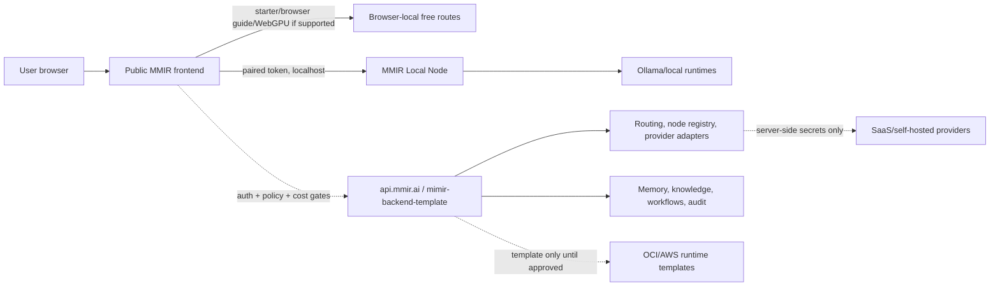

# MMIR Cross-Repo Review Gate D252

Date: 2026-05-25
Latest refresh: D302

## Scope

- `inkognitroz.github.io` at `43140c2` plus current D302 worktree review updates
- `mmir-local-node` at `54fe834` plus current D302 OpenAI-compatible alias updates
- `mimir-backend-template` at `e648af0` plus current D302 OpenAI-compatible alias updates
- `iac-autoprov` at `34c7e9c`
- `iac-autoprov-aws` at `943d199`

## Result

No P0 blocker was found in the fresh full-project review. One P1 contract mismatch was fixed during this refresh:

- Public manifests advertised OpenAI-compatible `/v1/models` and `/v1/chat/completions`.
- `mmir-local-node`, `mimir-backend-template` and the downloadable connector server only implemented `/models` and `/chat/completions`.
- D302 adds the `/v1` aliases, route manifest coverage, node conformance coverage and public connector checksum updates.

The intended zero-trust split remains intact:

- GitHub Pages is a public, non-authoritative UI, catalog, installer and evidence layer.
- Public frontend owns chat UX, local/session state, public-safe starter catalogs and user-facing progress.
- Local node owns local runtime access, pairing, Ollama discovery, model install/delete, health, hardware and local chat execution.
- Managed backend owns auth, access policy, rate limits, provider adapters, routing, node registry, memory, knowledge, workflows, evals, training plans, audit and server-side secret references.
- OCI/AWS runtime repos remain no-spend templates until explicit cloud-cost approval.
- Paid/provider/cloud routes remain blocked unless explicit approval and backend policy allow them.

## Layered Architecture

## Verified Evidence

- Public smoke suite: pass, 97 workflow smoke scripts after D302 fixes.
- Public JavaScript syntax and route manifest checks: pass.
- Public safety audit: pass.
- Public branding check: pass.
- Public performance budget: pass, 166688 first-paint JS bytes.
- Local node test suite: pass, 66 tests.
- Local node JSON lint and secret scan: pass.
- Local node conformance: pass, 11/11 checks, including `/v1/models` and `/v1/chat/completions`.
- Local node live process probe: pass, `/v1/models` returned `mistral:latest`, `/v1/chat/completions` returned `chat.completion`.
- Backend test suite: pass, 211 tests.
- Backend JSON lint and secret scan: pass.
- Backend managed route contract: pass, including `/v1/models` and `/v1/chat/completions`.
- Backend node fixture contract: pass.
- Backend live process probe: pass, `/v1/models` returned `mock-basic`, `/v1/chat/completions` returned `chat.completion`.
- OCI proxy syntax check: pass.
- AWS proxy syntax check: pass.

## Findings

| ID | Severity | Status | Finding | Next action |
| --- | --- | --- | --- | --- |
| CR-001 | P0 | Pass | No public secret leakage or public mutation-authority regression found across public, backend and local-node checks. | Keep public safety audit in quality/deploy workflows. |
| CR-002 | P0 | Pass | Backend source mutation, memory, knowledge, training, provider and share paths stay behind protected policy/auth gates. | Keep protected routes backend-only. |
| CR-003 | P1 | Fixed | OpenAI-compatible `/v1` aliases were advertised but not implemented in local/backend servers. | D302 implemented aliases and conformance coverage. |
| CR-004 | P1 | Watch | External `mmir.ai` and `api.mmir.ai` checks from this workstation are blocked by a URL filter for newly registered domains. This does not prove site failure, but it prevents independent external verification from this network. | Keep deterministic local/live tests green and verify from an unrestricted network when available. |
| CR-005 | P1 | Watch | Browser plugin live screenshot automation was unstable in this thread. Deterministic DOM/source/live-process QA is green, but it is not a full visual replacement. | Reintroduce screenshot QA when the browser bridge is reliable. |
| CR-006 | P1 | Watch | OCI/AWS templates parse, but no cloud runtime has been provisioned or tested because no-spend mode is active. | Keep cloud work template-only until explicit cost approval. |

## Architecture Decision

Continue with the current layered architecture. Do not replace it with a single Open WebUI clone. Instead:

1. Make the first screen feel as smooth as ChatGPT/Open WebUI.
2. Keep MMIR-specific orchestration below the chat composer and behind small, useful controls.
3. Keep public frontend harmless by construction.
4. Keep one OpenAI-compatible frontend adapter path for local node and managed API.
5. Keep provider secrets, paid calls, routing policy, memory, knowledge and org authority out of the public repo.

## Agent Work Rules

- One task slice should touch one layer unless a contract change requires both sides.
- Contract changes must update code, docs, route manifest and conformance/smoke checks in the same slice.
- UI buttons must have a handler and a smoke proof before they are treated as live.
- No model/provider may be shown as live unless it can be used through a free/local/protected route.
- No cloud/provider spend may start without explicit cost approval.

## Next

D254+ remains launch-critical: continue polishing the chat-first experience, make active free/local routes obvious, and keep the first visitor journey automatic. The next deep slice should add stronger runtime probing for the managed `api.mmir.ai` route so the UI says "checking/degraded" instead of trusting static manifest state when the public API is unreachable.
