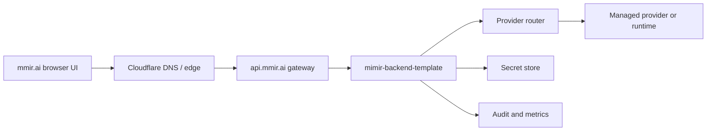

# MMIR Gateway Plan

This plan covers `D008`: how public managed AI traffic should enter MMIR.

## Decision

`api.mmir.ai` should be the only public managed API ingress for MMIR product traffic.

The gateway should terminate TLS, enforce safe headers, rate-limit requests, route to `mimir-backend-template`, and keep provider runtimes private.

## MVP Topology



## Responsibilities

Gateway owns:

- TLS and public hostname
- CORS preflight policy coordination with API
- request size caps
- coarse rate limiting
- security headers
- routing to the active API service
- deny-by-default for unknown paths

Managed API owns:

- authentication
- authorization
- provider routing policy
- model capability checks
- provider-specific timeouts
- audit events
- encrypted secret references

Infrastructure owns:

- reproducible gateway configuration
- deploy plan and rollback
- protected secrets
- health checks
- environment separation

## Required Public Routes

For MVP:

- `GET /health`
- `GET /status`
- `GET /models`
- `POST /chat/completions`
- `GET /metrics` only if protected or scrubbed

Deny by default:

- unknown paths
- debug endpoints
- provider-native admin APIs
- raw runtime ports
- infrastructure control endpoints

## Security Headers

Recommended gateway/API headers:

```text
Strict-Transport-Security: max-age=31536000; includeSubDomains; preload
X-Content-Type-Options: nosniff
Referrer-Policy: no-referrer
Permissions-Policy: camera=(), microphone=(), geolocation=()
Cache-Control: no-store for API responses with user data
```

CSP belongs primarily on the static frontend, but API responses should avoid rendering executable content.

## Rate Limit Starting Policy

Initial managed API policy:

| Route | Anonymous | Authenticated |
|---|---:|---:|
| `/health` | generous | generous |
| `/status` | limited | moderate |
| `/models` | limited | moderate |
| `/chat/completions` | disabled or very low demo limit | policy-based |
| `/metrics` | disabled | admin-only |

Paid provider routes should require explicit user/team policy before spend.

## Timeout Starting Policy

| Layer | Suggested timeout |
|---|---:|
| Gateway request | 60 seconds for non-stream, longer only for streaming |
| API provider call | 45 seconds non-stream |
| Health check | 2 seconds |
| Model list | 5 seconds |

Streaming should be added with heartbeat and abort support in `D019`.

## Environment Separation

Recommended environments:

| Environment | Host | Purpose |
|---|---|---|
| local | `localhost` | developer testing |
| dev | `dev-api.mmir.ai` later | integration testing |
| prod | `api.mmir.ai` | real users |

Production deploys should require protected workflow or manual approval once paid provider routes exist.

## Cloudflare Note

Cloudflare in front of GitHub Pages for the static site is fine. The security issue is not that users can infer GitHub Pages exists; the real risk is exposing secrets, runtime control APIs or raw model ports. Keep the public static site harmless and put sensitive operations behind `api.mmir.ai`.

## Done Criteria For D008

`D008` is done when:

- this gateway plan exists
- `mimir-backend-template` is designated as first API implementation
- public runtime/provider ports are explicitly out of scope
- rate limit, TLS, auth and route ownership are documented
- infrastructure work waits until local chat is stable
