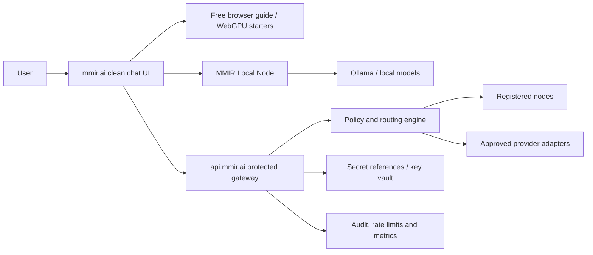

# MMIR Project Control - 2026-05-25

MMIR identity: **the orchestration layer for trusted AI**.

Current P0 user journey:

1. Open `mmir.ai`.
2. Land in a clean chat shell.
3. Chat immediately through the free MMIR Guide route.
4. Connect local AI through the local-node path when ready.
5. Keep advanced capabilities available, but subtle.

## Current Version Map

| Layer | Current state | Source files | Next owner |
| --- | --- | --- | --- |
| Public frontend | Clean chat-first shell, free guide fallback, hidden advanced controls | `public/mmir.html`, `public/apps/mimir-chat-portal/*` | Frontend agent |
| Public route manifest | Free browser routes plus auto-detected local node | `public/active-chat-nodes.json` | Frontend + local-node agents |
| API contract | Canonical v0 contract for health, status, models, nodes and chat | `docs/MMIR_API_CONTRACT_V0.md` | Architect + backend agent |
| Node contract | Local/hosted/edge node conformance contract | `docs/MMIR_NODE_CONNECTOR_CONTRACT.md` | Local-node agent |
| Gateway plan | `api.mmir.ai` as protected ingress, deny-by-default | `docs/MMIR_GATEWAY_PLAN.md` | Backend + infra agents |
| Agent workflow | Repo ownership, claim format, issue format and done criteria | `docs/AI_AGENT_OPERATING_MODEL.md` | Product/architect agents |

## Architecture Target

## Rules For Next Work

- Frontend must orchestrate, configure, visualize and manage. It must not own secrets, billing, provider keys or runtime authority.
- Backend/gateway must own auth, policy, rate limits, provider abstraction, secret references, audit and routing.
- Local node must bridge local runtimes through paired, localhost-first MMIR endpoints.
- Paid or unknown-cost routes must stay blocked until explicit budget approval.
- First screen should remain chat-first. Advanced features belong in More, drawers, model picker or protected capability panels.

## Agent-Ready P0 Slices

1. **P0 Frontend: Clean chat shell visual regression**
2. **P0 Backend: api.mmir.ai contract skeleton**
3. **P0 Local Node: conformance and installer proof**
4. **P0 QA: live deploy proof**
5. **P0 Security: zero-trust review**

## Current Known Gaps

- `api.mmir.ai` is documented, but the managed gateway/router needs implementation and protected deployment.
- Free first chat works as a truthful browser helper. A real hosted/free LLM route still needs backend ownership and cost policy.
- Local node connection flow exists conceptually and in public route manifests, but the installer-to-live-model proof must be verified against the actual `mmir-local-node` release.
- Multi-model compare and model discussions are contract-defined but should remain behind backend/router work until node registration and route policy are live.
