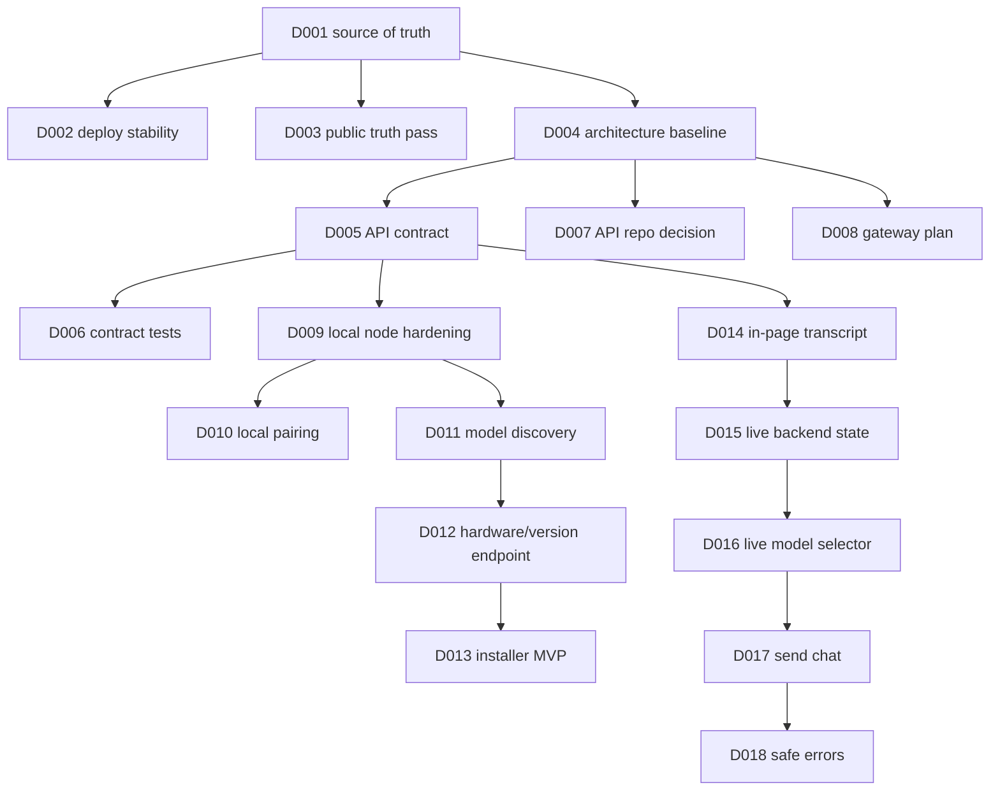

# MMIR Workstreams D001-D018

This file turns the first backlog slice into parallel work that can be assigned to different people or agents.

## Slice Goal

Complete the path from planning baseline to first real local chat:

- `D001-D008`: source of truth, deployment stability, public truth pass, architecture, API contract, tests, API repo decision, gateway plan
- `D009-D013`: secure and usable local node
- `D014-D018`: first real in-page chat loop

## Dependency Map

## Workstream A - Frontend Core

Primary repo: `inkognitroz.github.io`

Backlog IDs:

- `D003` Public-copy truth pass
- `D014` In-page chat transcript
- `D015` Live backend profile state
- `D016` Model selector from live data
- `D017` Send chat to active backend
- `D018` Safe error states

Concrete tasks:

1. Replace fake-live wording with `live`, `beta`, `planned`, `premium planned` labels.
2. Add an in-page transcript area under the composer.
3. Turn the current `Open chat` behavior into real submit behavior when a backend is active.
4. Fetch `/health`, `/status` and `/models` from the active backend.
5. Disable send until model and backend are valid.
6. Call `/chat/completions` first, falling back to legacy `/chat` only during migration.
7. Show specific next-step errors for offline node, CORS, bad URL, no model, timeout and API failure.

Acceptance criteria:

- User can see their prompt and assistant response in the same page.
- UI never implies planned features are live.
- Browser stores no provider secret.

## Workstream B - Local Node

Primary repo: `mmir-local-node`

Backlog IDs:

- `D009` Harden local node defaults
- `D010` Local pairing token
- `D011` Local model discovery
- `D012` Hardware and version endpoint
- `D013` One-command installer MVP

Concrete tasks:

1. Default bind host to `127.0.0.1`.
2. Replace permissive CORS with explicit origins.
3. Add request body limit, message validation and safe error format.
4. Add `/chat/completions` while keeping `/chat` as temporary legacy adapter.
5. Normalize Ollama `/api/tags` into the model format in `MMIR_API_CONTRACT_V0.md`.
6. Add `/version` or include version in `/health` and `/status`.
7. Add pairing token requirement for model/chat control routes.
8. Add install instructions that end with a successful `/health` check.

Acceptance criteria:

- Local node is not reachable from LAN by default.
- UI can discover live local models.
- Chat request validates before reaching Ollama.

## Workstream C - Managed API

Primary repo: `mimir-backend-template`

Backlog IDs:

- `D005` Canonical API contract
- `D006` Contract tests
- `D007` API repo decision
- `D008` Gateway/reverse-proxy plan

Concrete tasks:

1. Treat `mimir-backend-template` as the first `api.mmir.ai` implementation.
2. Add `/chat/completions` route matching the canonical contract.
3. Keep `/chat` only as legacy adapter.
4. Add provider adapter interface that returns canonical response shape.
5. Add tests for `/health`, `/status`, `/models`, invalid chat payloads and successful mock chat.
6. Prepare auth/rate-limit hooks without blocking local-first MVP.

Acceptance criteria:

- Frontend can use the same route shape for local and managed backends.
- Contract tests catch drift before deployment.

## Workstream D - Security And Architecture

Primary repo: `inkognitroz.github.io`, then mirrored by reference in implementation repos

Backlog IDs:

- `D004` Architecture boundary doc
- `D005` Canonical API contract
- `D008` Gateway/reverse-proxy plan
- early security rules for `D009-D018`

Concrete tasks:

1. Keep `MMIR_ARCHITECTURE_BASELINE.md` current.
2. Keep `MMIR_SECURITY_BASELINE.md` current.
3. Review every repo change against trust boundaries.
4. Block secrets in frontend.
5. Block public exposure of raw Ollama or local node control.
6. Require safe errors and validation on all routes.

Acceptance criteria:

- Every first-slice code change references architecture/security baseline.
- No new public route exposes runtime control without trust boundary.

## Workstream E - Deploy And Smoke

Primary repo: `inkognitroz.github.io`

Backlog IDs:

- `D002` Stabilize Pages and domain deploy
- frontend checks for `D014-D018`

Concrete tasks:

1. Keep `public/CNAME` set to `mmir.ai`.
2. Keep Pages workflow publishing `./public`.
3. Run post-deploy smoke checklist after UI changes.
4. Check both `https://mmir.ai` and `https://inkognitroz.github.io`.
5. Verify that planned/premium sections do not block first chat.

Acceptance criteria:

- Production page remains available.
- Deploys are repeatable.
- User can test the first chat path from the public page.

## Recommended Assignment Order

Start in this order:

1. D001-D008 foundation owner: complete docs and issue split.
2. Workstream B local node starts `D009-D011`.
3. Workstream A frontend starts `D003` and prepares `D014` layout.
4. Workstream C managed API starts `D005-D006` tests and `/chat/completions`.
5. Workstream A connects `D015-D018` after local node and contract are usable.

## Current Rule

Do not let platform work outrun product truth. The site should only present advanced infrastructure as planned or premium planned until users can complete a real chat loop.
